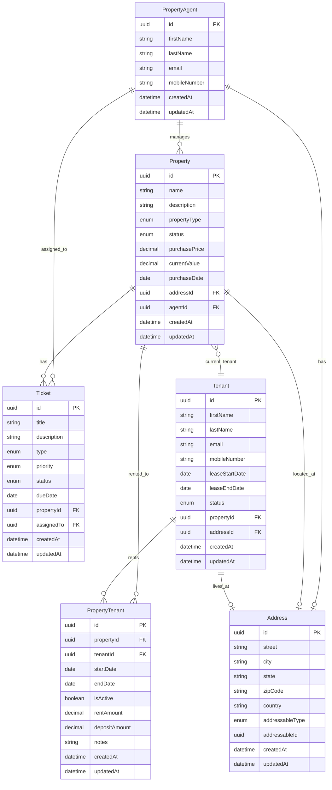

# Property Agent Management App

A full-stack property management application built with Node.js/TypeScript backend and Vue 3 frontend, featuring **shared types and Zod validation**.

## 🏗️ Project Structure

```
property-agent-app/
├── docs/               # Documentation
│   └── database-schema.md  # ERD and table definitions
├── shared/             # Shared types and Zod schemas
│   ├── src/
│   │   ├── schemas/    # Agent, Property, Tenant, Ticket, Address schemas
│   │   ├── types/      # TypeScript type exports
│   │   └── index.ts    # Main exports
│   └── package.json    # Zod dependency
├── backend/           # Node.js + Express + TypeScript API
│   ├── src/
│   │   ├── models/    # Class-based models (6 entities)
│   │   ├── repositories/ # Data access layer
│   │   ├── controllers/  # Request handlers
│   │   ├── routes/    # API routes
│   │   └── config/    # Swagger/Scalar API docs
│   └── package.json
├── frontend/          # Vue 3 + TypeScript + Vite
│   ├── src/
│   │   ├── views/     # List and Form components
│   │   ├── stores/    # Pinia state management
│   │   ├── api/       # Axios API clients
│   │   ├── types/     # Re-exports from shared
│   │   ├── router/    # Vue Router configuration
│   │   └── composables/ # Reusable logic (form generator)
│   └── package.json
└── package.json       # Root scripts for monorepo
```

## 🗄️ Database Schema

The application manages a comprehensive property management system with agents, properties, tenants, tickets, and addresses.



**Key Entities:**
- **PropertyAgent**: Manages properties and handles tickets
- **Property**: Real estate with status, pricing, and agent assignment
- **Tenant**: Individuals renting properties with lease information
- **Ticket**: Tasks/reminders auto-assigned to property's agent
- **Address**: Polymorphic addresses for properties, tenants, and agents
- **PropertyTenant**: Junction table tracking rental relationships

📄 [Full Database Schema Documentation](./docs/database-schema.md)

## ✨ Features

### Core Functionality
- **Property Management**: Track properties with types, status, pricing, and addresses
- **Agent Management**: Manage property agents with contact information
- **Tenant Management**: Handle tenant information and lease tracking
- **Ticket System**: Tasks/reminders with auto-assignment to property agents
- **Address System**: Polymorphic addresses for properties, tenants, and agents
- **Rental Relationships**: Track property-tenant relationships over time

### Technical Features
- **Shared Types with Zod**: Single source of truth for types and validation
- **Backend API**: RESTful CRUD endpoints with class-based models
- **Frontend UI**: Vue 3 with Composition API, Pinia, Radix UI components
- **API Documentation**: Interactive docs at `/api-docs` (Scalar)
- **Type Safety**: Full TypeScript coverage with runtime validation
- **Form Validation**: Client-side validation with Zod schemas
- **Test Data Generator**: Quick form testing with random realistic data
- **Modern Tooling**: ESLint 9, Prettier, pnpm, tsx, Tailwind CSS

### User Experience
- **Dropdown Selectors**: Property and agent selection with readable names
- **Status Badges**: Visual indicators for property, tenant, and ticket status
- **Auto-Assignment**: Tickets automatically assigned to property's agent
- **Responsive Design**: Mobile-friendly interface with Tailwind CSS

## 🚀 Quick Start

### Prerequisites

- Node.js 18+
- pnpm (install with `npm install -g pnpm`)

### Installation

```bash
# Install all dependencies (root + shared + backend + frontend)
pnpm run install:all
```

### Development

```bash
# Run both backend and frontend concurrently
pnpm run dev

# Backend runs on: http://localhost:3000
# Frontend runs on: http://localhost:5173
# API docs at: http://localhost:3000/api-docs
```

### Available Commands

```bash
# Install dependencies
pnpm run install:all        # Install all packages
pnpm run install:shared     # Install shared package only
pnpm run install:backend    # Install backend only
pnpm run install:frontend   # Install frontend only

# Development
pnpm run dev               # Run both servers concurrently
pnpm run dev:backend       # Run backend only
pnpm run dev:frontend      # Run frontend only

# Build
pnpm run build             # Build both projects
pnpm run build:backend     # Build backend only
pnpm run build:frontend    # Build frontend only

# Code Quality
pnpm run format            # Format all code with Prettier
pnpm run lint              # Lint all code with ESLint
pnpm run lint:fix          # Fix ESLint issues automatically
```

## � Technology Stack

### Shared

- **Zod** 3.23.8 - Runtime validation and type inference
- **TypeScript** 5.3.3

### Backend

- **Node.js** with **TypeScript** 5.3.3
- **Express** 4.18.2
- **UUID** 9.0.1
- **Scalar** 0.4.46 (API documentation)
- **tsx** 4.21.0 (Fast TypeScript execution)
- **ESLint** 9.17.0 + **Prettier** 3.4.2

### Frontend

- **Vue 3** 3.5.26 (Composition API)
- \*\*� API Endpoints

### Agents
| Method | Endpoint        | Description      |
| ------ | --------------- | ---------------- |
| GET    | /api/agents     | Get all agents   |
| GET    | /api/agents/:id | Get agent by ID  |
| POST   | /api/agents     | Create new agent |
| PUT    | /api/agents/:id | Update agent     |
| DELETE | /api/agents/:id | Delete agent     |

### Properties
| Method | Endpoint            | Description           |
| ------ | ------------------- | --------------------- |
| GET    | /api/properties     | Get all properties    |
| GET    | /api/properties/:id | Get property by ID    |
| POST   | /api/properties     | Create new property   |
| PUT    | /api/properties/:id | Update property       |
| DELETE | /api/properties/:id | Delete property       |

### Tenants
| Method | Endpoint          | Description         |
| ------ | ----------------- | ------------------- |
| GET    | /api/tenants      | Get all tenants     |
| GET    | /api/tenants/:id  | Get tenant by ID    |
| POST   | /api/tenants      | Create new tenant   |
| PUT    | /api/tenants/:id  | Update tenant       |
| DELETE | /api/tenants/:id  | Delete tenant       |

### Tickets
| Method | Endpoint          | Description         |
| ------ | ----------------- | ------------------- |
| GET    | /api/tickets      | Get all tickets     |
| GET    | /api/tickets/:id  | Get ticket by ID    |
| POST   | /api/tickets      | Create new ticket   |
| PUT    | /api/tickets/:id  | Update ticket       |
| DELETE | /api/tickets/:id  | Delete ticket       |

### Addresses
| Method | Endpoint            | Description           |
| ------ | ------------------- | --------------------- |
| GET    | /api/addresses      | Get all addresses     |
| GET    | /api/addresses/:id  | Get address by ID     |
| POST   | /api/addresses      | Create new address    |
| PUT    | /api/addresses/:id  | Update address        |
| DELETE | /api/addresses/:id  | Delete address        |

### Property-Tenant Relationships
| Method | Endpoint                    | Description                   |
| ------ | --------------------------- | ----------------------------- |
| GET    | /api/property-tenants       | Get all relationships         |
| GET    | /api/property-tenants/:id   | Get relationship by ID        |
| POST   | /api/property-tenants       | Create new relationship       |
| PUT    | /api/property-tenants/:id   | Update relationship           |
| DELETE | /api/property-tenants/:id   | Delete relationship           |

Interactive API documentation: http://localhost:3000/api-docs

## 🎨 Code Style

- **2 spaces** indentation
- **Single quotes** for strings
- **No semicolons**
- **Format on save** enabled in VSCode
- ESLint 9 with flat config

## 📖 Documentation

- [Database Schema](./docs/database-schema.md) - ERD, tables, relationships
- [Backend Documentation](./backend/README.md) - API, models, repositories
- [Frontend Documentation](./frontend/README.md) - Components, stores, routing
- [Shared Types Documentation](./shared/README.md) - Schemas, validation, usage

## 🔄 Development Workflow

1. **Modify shared schemas**: Edit `shared/schemas.ts`
2. **Types auto-update**: Backend and frontend get updated types
3. **Validation works everywhere**: Same validation rules apply
4. **Hot reload**: Both servers detect changes automatically

## 🏛️ Architecture

### Backend Architecture

```
Request → Routes → Controller → Repository → In-Memory Storage
                      ↓
                 Validation (Zod)
                      ↓
                  Model Class
```

### Frontend Architecture

```
Component → Pinia Store → API Service → Backend API
     ↓
Validation (Zod)
```

## 📝 Example: Creating an Agent

### Backend Validation

```typescript
// Automatic validation in PropertyAgent.create()
const agent = PropertyAgent.create(data) // Throws ZodError if invalid
```

### Frontend Validation

```typescript
// Client-side validation before API call
try {
  CreatePropertyAgentSchema.parse(formData)
  await agentService.createAgent(formData)
} catch (error) {
  if (error instanceof ZodError) {
    // Show validation errors to user
  }
}
```

## 🤝 Contributing

1. Format code: `pnpm run format`
2. Fix linting: `pnpm run lint:fix`
3. Test endpoints at http://localhost:3000/api-docs

## 📄 License

MIT

---

Built with ❤️ using Vue 3, TypeScript, Express, and Zod
})

export type PropertyAgent = z.infer<typeof PropertyAgentSchema>

````

**Benefits:**

- ✅ Single source of truth for types
- ✅ Runtime validation on backend and frontend
- ✅ Type inference from schemas
- ✅ Consistent validation rules everywhere

## 📝 Available Scripts

```bash
pnpm run install:all      # Install all dependencies
pnpm run dev              # Run both servers concurrently
pnpm run dev:backend      # Run backend only
pnpm run dev:frontend     # Run frontend only
pnpm run build            # Build both projects
pnpm run build:backend    # Build backend only
pnpm run build:frontend   # Build frontend only
pnpm run format           # Format all code with Prettier
pnpm run lint             # Lint backend and frontend
pnpm run lint:fix         # Fix linting issues
````

## 📄 License

ISC

---

Built with ❤️ using Vue 3, TypeScript, and Express
