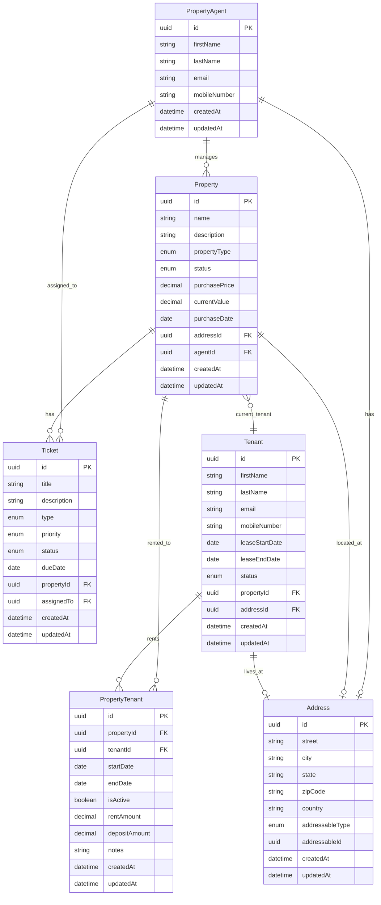

# Property Management App - Database Schema

## Entity Relationship Diagram

## Tables

### PropertyAgent
Property management agents who manage properties and handle tickets.

| Column | Type | Constraints | Description |
|--------|------|-------------|-------------|
| id | UUID | PRIMARY KEY | Unique identifier |
| firstName | VARCHAR | NOT NULL | Agent's first name |
| lastName | VARCHAR | NOT NULL | Agent's last name |
| email | VARCHAR | NOT NULL, UNIQUE | Agent's email address |
| mobileNumber | VARCHAR(15) | NOT NULL | Mobile number (10-15 digits) |
| createdAt | TIMESTAMP | NOT NULL | Record creation timestamp |
| updatedAt | TIMESTAMP | NOT NULL | Record update timestamp |

**Relationships:**
- One agent can manage many properties
- One agent can be assigned to many tickets
- One agent can have one address (polymorphic)

---

### Property
Real estate properties managed by agents.

| Column | Type | Constraints | Description |
|--------|------|-------------|-------------|
| id | UUID | PRIMARY KEY | Unique identifier |
| name | VARCHAR | NOT NULL | Property name |
| description | TEXT | NULL | Property description |
| propertyType | ENUM | NOT NULL | Type: residential, commercial, industrial, land, mixed-use |
| status | ENUM | NOT NULL | Status: available, occupied, maintenance, sold |
| purchasePrice | DECIMAL | NULL | Original purchase price |
| currentValue | DECIMAL | NULL | Current market value |
| purchaseDate | DATE | NULL | Date of purchase |
| addressId | UUID | FOREIGN KEY (Address.id) | Property address |
| agentId | UUID | FOREIGN KEY (PropertyAgent.id) | Managing agent |
| createdAt | TIMESTAMP | NOT NULL | Record creation timestamp |
| updatedAt | TIMESTAMP | NOT NULL | Record update timestamp |

**Relationships:**
- Many properties belong to one agent
- One property has many tickets
- One property has many property-tenant relationships
- One property has one address
- One property can have one current tenant

---

### Address
Polymorphic address table for properties, tenants, and agents.

| Column | Type | Constraints | Description |
|--------|------|-------------|-------------|
| id | UUID | PRIMARY KEY | Unique identifier |
| street | VARCHAR | NOT NULL | Street address |
| city | VARCHAR | NOT NULL | City |
| state | VARCHAR | NOT NULL | State |
| zipCode | VARCHAR(10) | NOT NULL | ZIP code (12345 or 12345-6789) |
| country | VARCHAR | NOT NULL, DEFAULT 'USA' | Country |
| addressableType | ENUM | NOT NULL | Type: property, tenant, agent |
| addressableId | UUID | NOT NULL | Polymorphic foreign key |
| createdAt | TIMESTAMP | NOT NULL | Record creation timestamp |
| updatedAt | TIMESTAMP | NOT NULL | Record update timestamp |

**Indexes:**
- `idx_addressable` on (addressableType, addressableId)

**Relationships:**
- Polymorphic relationship (can belong to Property, Tenant, or PropertyAgent)

---

### Tenant
Individuals who rent properties.

| Column | Type | Constraints | Description |
|--------|------|-------------|-------------|
| id | UUID | PRIMARY KEY | Unique identifier |
| firstName | VARCHAR | NOT NULL | Tenant's first name |
| lastName | VARCHAR | NOT NULL | Tenant's last name |
| email | VARCHAR | NOT NULL | Tenant's email address |
| mobileNumber | VARCHAR(15) | NOT NULL | Mobile number (10-15 digits) |
| leaseStartDate | DATE | NULL | Lease start date |
| leaseEndDate | DATE | NULL | Lease end date |
| status | ENUM | NOT NULL | Status: active, inactive, pending |
| propertyId | UUID | FOREIGN KEY (Property.id) | Current property |
| addressId | UUID | FOREIGN KEY (Address.id) | Tenant's address |
| createdAt | TIMESTAMP | NOT NULL | Record creation timestamp |
| updatedAt | TIMESTAMP | NOT NULL | Record update timestamp |

**Relationships:**
- Many tenants can be associated with one property
- One tenant can have many property-tenant relationships
- One tenant can have one address

---

### Ticket
Reminders, notes, and tasks related to properties.

| Column | Type | Constraints | Description |
|--------|------|-------------|-------------|
| id | UUID | PRIMARY KEY | Unique identifier |
| title | VARCHAR | NOT NULL | Ticket title |
| description | TEXT | NULL | Detailed description |
| type | ENUM | NOT NULL | Type: reminder, note, maintenance, inspection, payment, other |
| priority | ENUM | NOT NULL | Priority: low, medium, high, urgent |
| status | ENUM | NOT NULL | Status: open, in-progress, closed, cancelled |
| dueDate | DATE | NULL | Due date |
| propertyId | UUID | FOREIGN KEY (Property.id) | Related property |
| assignedTo | UUID | FOREIGN KEY (PropertyAgent.id) | Assigned agent |
| createdAt | TIMESTAMP | NOT NULL | Record creation timestamp |
| updatedAt | TIMESTAMP | NOT NULL | Record update timestamp |

**Relationships:**
- Many tickets belong to one property
- Many tickets can be assigned to one agent

---

### PropertyTenant
Junction table managing property-tenant rental relationships.

| Column | Type | Constraints | Description |
|--------|------|-------------|-------------|
| id | UUID | PRIMARY KEY | Unique identifier |
| propertyId | UUID | FOREIGN KEY (Property.id) | Property being rented |
| tenantId | UUID | FOREIGN KEY (Tenant.id) | Tenant renting the property |
| startDate | DATE | NOT NULL | Rental start date |
| endDate | DATE | NULL | Rental end date |
| isActive | BOOLEAN | NOT NULL, DEFAULT true | Active rental status |
| rentAmount | DECIMAL | NULL | Monthly rent amount |
| depositAmount | DECIMAL | NULL | Security deposit amount |
| notes | TEXT | NULL | Additional notes |
| createdAt | TIMESTAMP | NOT NULL | Record creation timestamp |
| updatedAt | TIMESTAMP | NOT NULL | Record update timestamp |

**Indexes:**
- `idx_property_tenant` on (propertyId, tenantId)
- `idx_active_rentals` on (isActive, endDate)

**Relationships:**
- Many-to-many relationship between Property and Tenant
- One property-tenant record belongs to one property
- One property-tenant record belongs to one tenant

---

## Key Relationships

1. **Agent → Property**: One-to-Many
   - An agent manages multiple properties
   - Auto-assigns agent when creating tickets for their properties

2. **Property → Ticket**: One-to-Many
   - Properties have multiple tickets/tasks
   - Tickets inherit agent from property (auto-assignment)

3. **Property → PropertyTenant → Tenant**: Many-to-Many
   - Properties can have multiple tenants over time
   - Tenants can rent multiple properties over time
   - Junction table tracks lease details and history

4. **Polymorphic Address**:
   - Properties have addresses (location)
   - Tenants have addresses (residence)
   - Agents have addresses (office/contact)
   - Uses addressableType and addressableId for flexibility

5. **Tenant → Property**: Many-to-One (Current)
   - Tracks the current property a tenant is associated with
   - Historical rentals tracked via PropertyTenant table

---

## Business Rules

1. **Ticket Assignment**:
   - When creating a ticket, the assigned agent is automatically set from the property's agent
   - Field is disabled in the UI when auto-assigned
   - Can be manually set if property has no agent

2. **Addresses**:
   - Polymorphic design allows flexible address assignment
   - Each entity can have multiple addresses through the polymorphic relationship

3. **Lease Management**:
   - PropertyTenant tracks all rental relationships
   - isActive flag indicates current rentals
   - endDate can be null for ongoing leases

4. **Property Status**:
   - available: Ready for rental
   - occupied: Currently rented
   - maintenance: Under repair
   - sold: No longer in portfolio

5. **Ticket Priority**:
   - Urgent tickets should be addressed immediately
   - Priority affects sorting and notifications
